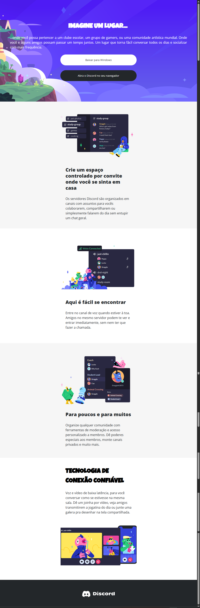
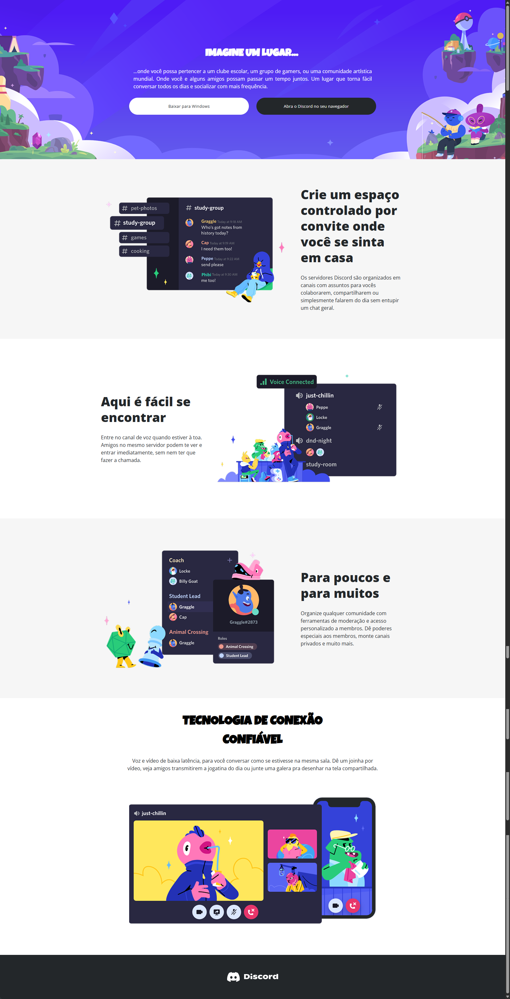

# trilha-css-desafio-04
Desafio da DIO, aplicando técnicas de responsividade para o site do Discord.

A metodologia utilizada no desenvolvimento deste desafio foi o Mobile First que se trata de uma abordagem de desenvolvimento de sites e aplicações web onde o design e a estrutura do layout são pensados primeiro para dispositivos móveis, como celulares e tablets, e só depois adaptados para telas maiores, como desktops.

A página do Desafio de Reponsividade pode ser acessada <a href="https://bruno-regis.github.io/trilha-css-desafio-04/">aqui</a>

## Resultado Final para tela Mobile (Tamanho P)

## Resultado Final para telas de Tablets (Tamanho M)

## Resultado Final para telas maiores (Tamanho G)

